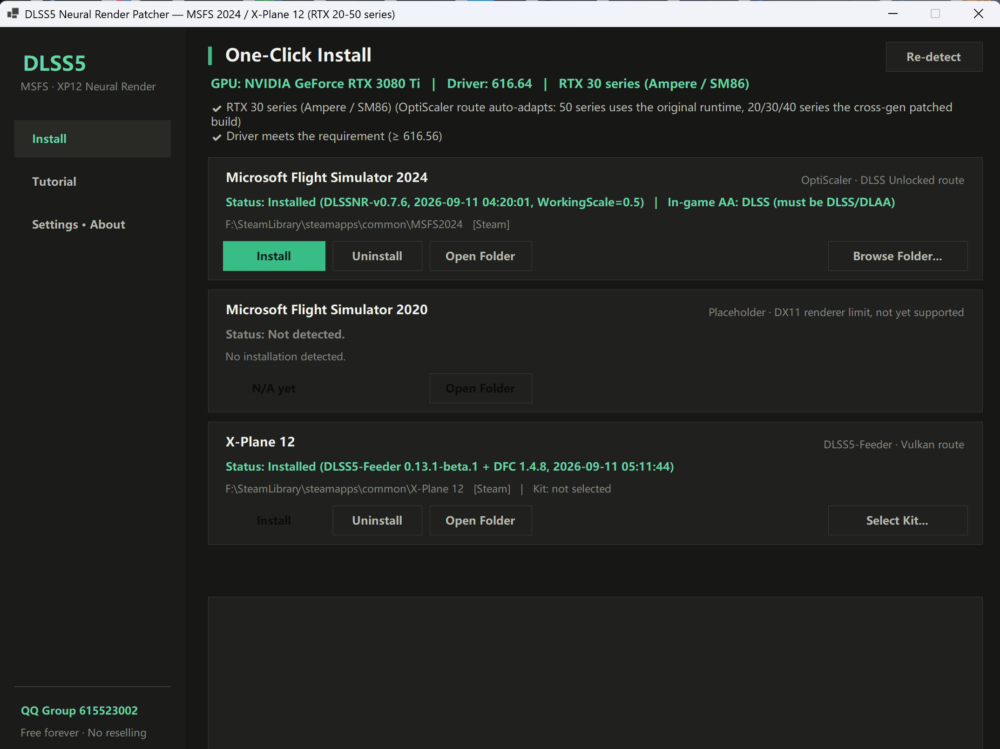

<div align="center">

# Flightsim DLSS5

**One-click DLSS5 neural rendering for Microsoft Flight Simulator 2024 and X-Plane 12 — for ALL RTX 20 / 30 / 40 / 50 series GPUs**

English | [简体中文](README.md)

</div>

---

Official DLSS neural rendering (transformer models + Neural Rendering) ships only with RTX 50 series. This project brings the **neural-rendering pass** to every RTX GPU from the 20-series up, packaged as a **bilingual (Chinese/English), single-EXE, portable** patcher.



## ✨ Features

- 🎮 **Three game cards**: MSFS 2024 / MSFS 2020 (Beta) / X-Plane 12 — each card keeps just two buttons: Install and Uninstall
- 🌐 **Bilingual UI**: pick your language on first launch, switch anytime in Settings
- 📦 **Fully offline**: every install component (~440MB) is embedded in a single EXE — download once, install offline forever, zero network config
- 🖥️ **Dark card-style UI**, native WinForms single EXE (~510 MB, self-contained), high-DPI / 4K ready
- 🔒 **Safe & reversible**: installs back up every modified file and config; uninstall restores everything — saves and add-ons are never touched
- 🧠 **Per-GPU-generation auto-tuning** of the NR runtime and defaults; RTX 50 series automatically gets NVIDIA's original runtime
- 🧰 **GUI + CLI** in one binary (script/CI friendly)

## 🎮 Supported games & routes

| Game | Route | How it works | In-game menu |
|---|---|---|---|
| MSFS 2024 | DLSS Unlocked / OptiScaler | Hooks the game's own DLSS calls and stacks the neural-render pass on top of the upscaled output | Insert |
| X-Plane 12 | DLSS5-Feeder + Deep Fried Chicken | No native DLSS: synthesizes the DLSS contract + shader-estimated motion vectors + neural rendering | Home |
| MSFS 2020 | Beta · same flow as 2024 | Experimental: identical flow to 2024, not yet field-tested — feedback welcome | Insert |

## 🚀 Getting started

1. Download `DLSS5Patcher.exe` from [Releases](../../releases) (or build it yourself), right-click → **Run as administrator**
2. Choose your interface language on first launch
3. The tool auto-detects your GPU, driver and game folders (Steam / Microsoft Store, with manual browse as a fallback)
4. **MSFS 2024**: click Install on its card (package is embedded — no internet needed, takes about a minute)
5. **X-Plane 12**: click Select Kit... and point it at a DLSS5-Feeder kit folder, then click Install
6. Verify in game:
   - MSFS 2024: press `Insert` → OptiScaler menu → DLSS Neural Rendering should show `Running - xx ms per frame`; set the game's Anti-Aliasing to **DLSS/DLAA**
   - X-Plane 12: press `Home` → verify MotionEstimation and DLSS5_Feed are enabled → the Deep Fried Chicken tab should show `standalone neural pipeline active`

> 📖 The in-app Tutorial page has detailed step-by-step instructions (including what to send the author when something goes wrong).

## ⌨️ Command line

```
DLSS5Patcher.exe --detect                              # detect GPU and game install states
DLSS5Patcher.exe --install [scale] [--proxy url]       # install for MSFS 2024
DLSS5Patcher.exe --uninstall                           # uninstall from MSFS 2024
DLSS5Patcher.exe --install-xp12 [--kit dir]            # install for XP12
DLSS5Patcher.exe --uninstall-xp12                      # uninstall from XP12
```

## ⚙️ Per-GPU-generation adaptation (MSFS route)

| Generation | NR runtime | Default WorkingScale |
|---|---|---|
| RTX 20/30 (Turing/Ampere) | Cross-gen patched 310.8 | **0.5** |
| RTX 40 (Ada) | Cross-gen patched 310.8 | 0.75 |
| RTX 50 (Blackwell) | NVIDIA original 310.8 (auto-switched) | 1.0 |

Driver requirement: **≥ 616.56**.

## 🧩 XP12 kit

Installing into XP12 requires a kit folder (described in the in-app tutorial) containing:
`dlss5-feed.addon64`, `deep-fried-chicken.addon64`, `deep-fried-chicken-nvngx.dll`, `deep-fried-chicken.cfg`, `nvngx_dlssnr.dll`, `nvngx_dlss.dll`, and `reshade-shaders\Shaders\` (DLSS5_Feed.fx and the MotionEstimation shaders).
Official ReShade framework headers (ReShade.fxh etc.) are added automatically by the tool.

## ❓ Known limitations

- MSFS 2020 support is **BETA**: identical flow to 2024 but not yet field-tested (its DX11 renderer may be incompatible) — uninstall and report if anything misbehaves
- RTX 20/30 series: noticeable base-framerate cost (inherent to the approach)
- XP12: motion vectors are shader-estimated — fast camera moves show brief ghosting
- XP12 needs the `--allow_reshade` launch parameter (prevents the game from blocking the layer)
- 8GB-VRAM cards may crash with VRAM overflow while DLSS5 is on (the game's own memory pressure): the installer auto-recommends WorkingScale by VRAM (8GB → 0.5, smaller → 0.35); lower it in Settings and reinstall if it still overflows
- RTX 40/50 adaptation logic has not been widely verified on physical cards — feedback welcome
- ⚠️ Do NOT accept the "Update available" prompt in the OptiScaler menu (the mainline build has no neural rendering)

## 🧠 How it works

MSFS: game DLSS call → OptiScaler (dxgi.dll hook, Input: DLSS) → NGX evaluation intercepted → the neural-render pass (`nvngx_dlssnr.dll`, 310.8, ShortFuse cross-gen patch unlocks 20/30 series) runs on top of the upscaled output → Streamline 2.14.1 supplies frame metadata.
XP12: DLSS5-Feeder synthesizes the DLSS contract (Vulkan implicit layer) + MotionEstimation shaders estimate motion vectors → Deep Fried Chicken consumes the data to drive neural rendering.

## 🛠️ Building from source

```
git clone https://github.com/JCH2333/Flightsim-DLSS5.git
cd Flightsim-DLSS5/src/DLSS5Patcher
dotnet build -c Release
# publish a single-file EXE:
dotnet publish -c Release -r win-x64 --self-contained true -p:PublishSingleFile=true -o ../../publish
```

Requirements: .NET 8 SDK (`net8.0-windows` + WinForms), Windows 10/11 only.

> Note: the install packages (`src/DLSS5Patcher/assets/`, ~440MB) are not stored in this repository due to size.
> To build from source you must place them there yourself:
> `dlss-unlocked-standalone-DLSSNR-v0.7.6.zip` (SHA256 `ca824acb…`), `ReShade64.dll` / `ReShade64.json` (extracted from the ReShade 6.8.0 Addon installer),
> and `ReShade.fxh` / `ReShadeUI.fxh` / `DrawText.fxh`. Most users should simply grab a ready-made EXE from [Releases](../../releases).

Code layout: `MainForm.cs` (shell + business logic), `Ui/Theme.cs` (design tokens & control factory), `Ui/HomePage.cs` (game cards + log), `Ui/TutorialPage.cs`, `Ui/AboutPage.cs`, `Ui/LanguageDialog.cs` (first-run language picker), `Core/` (installers, game locator, localization helper and config).

## ⚖️ Statement

All resources come from the internet. This tool is completely free — **reselling it is strictly prohibited.** The tool and the components it uses are for personal study and exchange only; please support official releases. If you paid for this tool, refund immediately and report the seller.
