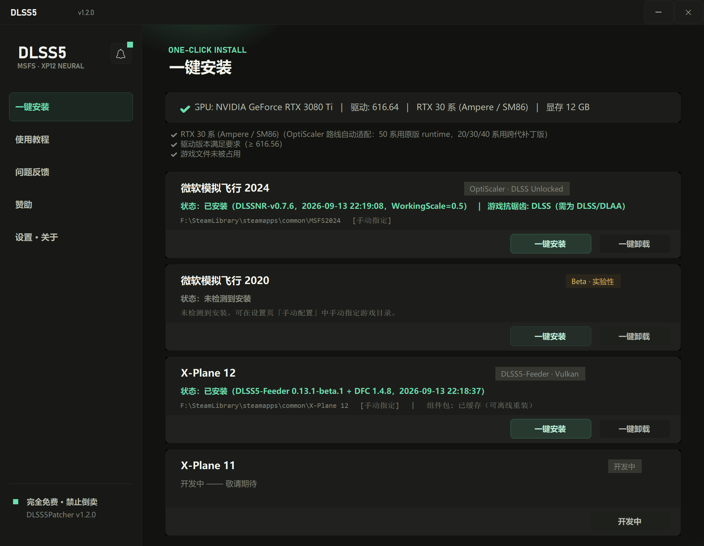
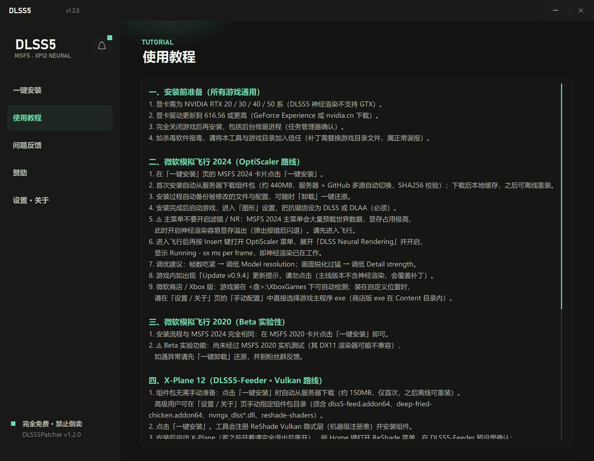
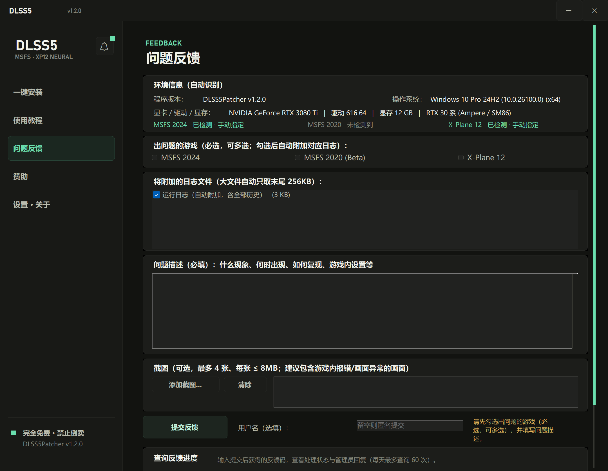
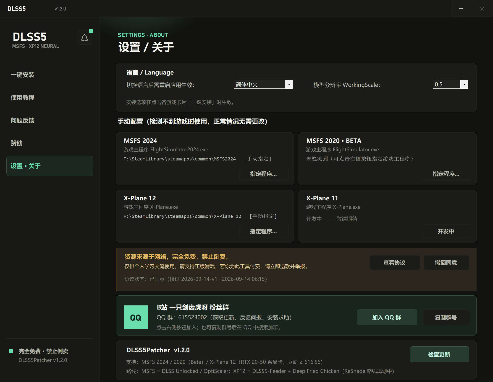
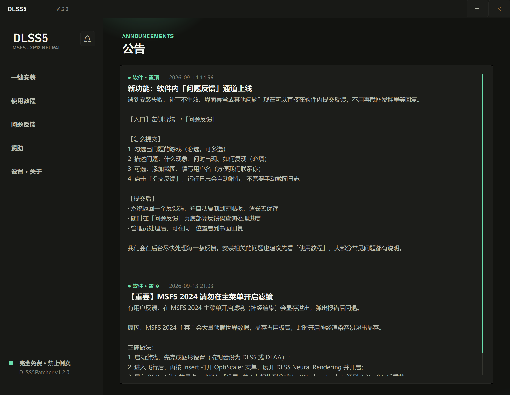

<div align="center">

# Flightsim DLSS5

**一键为《微软模拟飞行 2024》与《X-Plane 12》安装 DLSS5 神经渲染 —— 适配 RTX 20 / 30 / 40 / 50 全系显卡**

[English](README.en.md) | 简体中文

</div>

---

官方 DLSS 神经渲染（DLSS 4/5 transformer 模型 + Neural Rendering）只随 RTX 50 系提供。本项目通过社区方案把**神经渲染 pass** 带到 20–50 系全部 RTX 显卡，并做成一个**中文/英文双语、单 EXE、无需安装**的图形化补丁工具。内置**问题反馈**（反馈码查询处理进度）、**公告**、**使用教程**与**自动更新**。



## ✨ 特性

- 🎮 **三张游戏卡片**：MSFS 2024 / MSFS 2020（Beta 实验版）/ X-Plane 12，每张卡片只保留「一键安装」「一键卸载」，极简操作
- 🆘 **软件内问题反馈**：自动附带运行日志与安装清单，可加截图与用户名；提交后获得反馈码（自动复制），凭码随时查询处理进度与管理员回复
- 📢 **公告系统**：公告页 + 启动弹窗，重要提醒（如主菜单滤镜警告）精准触达
- 🌐 **中英双语**：首次启动选择语言，设置页可随时切换
- 📦 **极致轻量 + 服务器分发**：本体仅约 72MB（零内嵌包体）；安装时自动从自有服务器下载组件包（服务器 → GitHub → 镜像多源容灾、断点续传、SHA256 校验），下载后本地缓存、可离线重装
- 🔄 **自动更新**：启动时自动检查更新，发现新版本强制更新（多源下载 + SHA256 校验 + 限速看门狗，完成后自动替换重启）
- 🖥️ **深色卡片式 UI**，原生 WinForms 单 EXE（约 72MB，自包含）；多显示器不同 DPI 缩放间自由拖动，尺寸/字体自适应
- 🔒 **安全可回滚**：安装自动备份被修改的文件与配置，卸载一键还原；卸载不影响存档与插件
- 🧠 **按 GPU 世代自动适配** NR runtime 与默认参数；RTX 50 系自动切换 NVIDIA 原版 runtime
- 🧰 **图形界面 + 命令行** 双模式（CI / 脚本友好）

## 🖼️ 界面预览

| 使用教程 | 问题反馈 |
|---|---|
|  |  |

| 设置 / 关于 | 公告 |
|---|---|
|  |  |

## 🎮 支持游戏与路线

| 游戏 | 路线 | 原理 | 游戏内菜单 |
|---|---|---|---|
| MSFS 2024 | DLSS Unlocked / OptiScaler | 接管游戏自带 DLSS 调用，在超分输出上叠加神经渲染 pass | Insert 键 |
| X-Plane 12 | DLSS5-Feeder + Deep Fried Chicken | 游戏无原生 DLSS：合成 DLSS 契约 + 着色器估算运动矢量 + 神经渲染 | Home 键 |
| MSFS 2020 | Beta · 同 2024 流程 | 实验性支持：安装流程与 2024 完全相同，未经实机测试，欢迎反馈 | Insert |

## 🚀 使用方法

1. 前往 [Releases](../../releases) 下载 `DLSS5Patcher.exe`（或自行构建），右键**以管理员身份运行**
2. 首次启动选择界面语言（中文 / English），并滚动阅读用户协议
3. 工具自动检测 GPU、驱动与游戏目录（Steam / 微软商店均可，也可手动指定）
4. **MSFS 2024**：直接点卡片上的「一键安装」（首次自动下载组件包约 440MB，多源容灾；之后本地缓存可离线重装），全程约 1-2 分钟
5. **X-Plane 12**：同样直接「一键安装」（组件包约 150MB 自动下载）
6. 游戏内验证：
   - MSFS 2024：`Insert` 键 → OptiScaler 菜单 → DLSS Neural Rendering 应显示 `Running - xx ms per frame`；游戏抗锯齿需设为 **DLSS/DLAA**
   - X-Plane 12：`Home` 键 → 确认 MotionEstimation 与 DLSS5_Feed 已启用 → Deep Fried Chicken 标签页显示 `standalone neural pipeline active`

> 📖 更详细的图文教程请看软件内「使用教程」页。遇到问题？用左侧「问题反馈」直接提交（自动附带日志），凭反馈码可查询处理进度。

## ⌨️ 命令行模式

```
DLSS5Patcher.exe --detect                              # 检测 GPU 与各游戏安装状态
DLSS5Patcher.exe --install [scale] [--proxy url]       # MSFS 2024 安装
DLSS5Patcher.exe --uninstall                           # MSFS 2024 卸载
DLSS5Patcher.exe --install-xp12 [--kit 目录]           # XP12 安装
DLSS5Patcher.exe --uninstall-xp12                      # XP12 卸载
```

## ⚙️ 按 GPU 世代的自动适配（MSFS 路线）

| 世代 | NR runtime | 默认 WorkingScale |
|---|---|---|
| RTX 20/30（Turing/Ampere） | 跨代补丁版 310.8 | **0.5** |
| RTX 40（Ada） | 跨代补丁版 310.8 | 0.75 |
| RTX 50（Blackwell） | NVIDIA 原版 310.8（自动切换） | 1.0 |

驱动要求：**≥ 616.56**。

## 🧩 XP12 组件包

XP12 安装需要一个组件包目录（软件内教程附带说明），必须包含：
`dlss5-feed.addon64`、`deep-fried-chicken.addon64`、`deep-fried-chicken-nvngx.dll`、`deep-fried-chicken.cfg`、`nvngx_dlssnr.dll`、`nvngx_dlss.dll`、`reshade-shaders\Shaders\`（DLSS5_Feed.fx 与 MotionEstimation 系列）。
ReShade 官方框架头文件（ReShade.fxh 等）工具会自动补齐。

## ❓ 已知限制

- MSFS 2020 为 **Beta 实验性支持**：流程与 2024 完全相同但未经实机测试（其 DX11 渲染器可能不兼容），异常时请一键卸载并反馈
- RTX 20/30 系：基础帧率明显下降（方案固有代价）
- XP12：运动矢量为着色器估算，快速移动视角有短暂重影
- XP12 需 `--allow_reshade` 启动参数（防游戏主动屏蔽层）
- 8GB 显存显卡开启 DLSS5 后可能爆显存崩溃（游戏自身内存压力）：安装器已按显存自动推荐 WorkingScale（8GB → 0.5，更小 → 0.35），仍溢出可在设置页手动调低后重装
- 40/50 系自动适配逻辑未在实体卡上广泛验证，欢迎通过软件内「问题反馈」提交实测结果
- ⚠️ OptiScaler 菜单的 "Update available" 指向主线版（不含神经渲染），**勿升级**

## 🧠 原理

MSFS：游戏 DLSS 调用 → OptiScaler（dxgi.dll 接管，Input: DLSS）→ 拦截 NGX 评估 → 在超分输出上叠加 `nvngx_dlssnr.dll`（310.8，ShortFuse 跨代补丁解锁 20/30 系）的神经渲染 pass → Streamline 2.14.1 提供帧元数据。
XP12：DLSS5-Feeder 合成 DLSS 契约（Vulkan 隐式层）+ MotionEstimation 着色器估算运动矢量 → Deep Fried Chicken 消费数据驱动神经渲染。

## 🛠️ 从源码构建

```
git clone https://github.com/JCH2333/Flightsim-DLSS5.git
cd Flightsim-DLSS5/src/DLSS5Patcher
dotnet build -c Release
# 发布单文件 EXE：
dotnet publish -c Release -r win-x64 --self-contained true -p:PublishSingleFile=true -o ../../publish
```

要求：.NET 8 SDK（`net8.0-windows` + WinForms），仅支持 Windows 10/11。

> 注意：v1.1.0 起 EXE 不再内嵌任何组件包，安装时从分发服务器（主源）与 GitHub Release（备用）自动下载。
> 组件包与服务器部署见 `server/DEPLOY.md`；XP12 组件包可用 `tools/make_kit_zip.py` 从本地素材打包（SHA256 需同步写入 `Core/PackageCatalog.cs`）。
> 环境变量 `DLSS5_REPO` 或 config `repo=` 可覆盖主源地址（测试/应急）。普通用户建议直接从 [Releases](../../releases) 下载现成 EXE。

代码结构：`MainForm.cs`（外壳 + 业务逻辑）、`Ui/Theme.cs`（设计令牌与控件工厂）、`Ui/HomePage.cs`（三卡片 + 检测）、`Ui/TutorialPage.cs`、`Ui/FeedbackPage.cs`（问题反馈）、`Ui/AnnouncementsPage.cs`（公告）、`Ui/SponsorPage.cs`、`Ui/AboutPage.cs`、`Ui/LanguageDialog.cs`（首启语言选择）、`Core/`（安装器、游戏定位、公告/反馈客户端、双语助手与配置）；`server/`（分发与 CMS/反馈 API）。

## ⚖️ 声明

**资源来源于网络，完全免费，禁止倒卖。** 本工具及其引用的组件仅供个人学习交流使用，请支持正版游戏；若你为此工具付费，请立即退款并举报。
